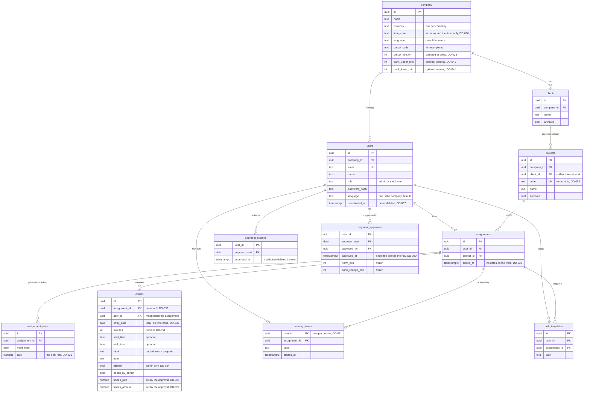
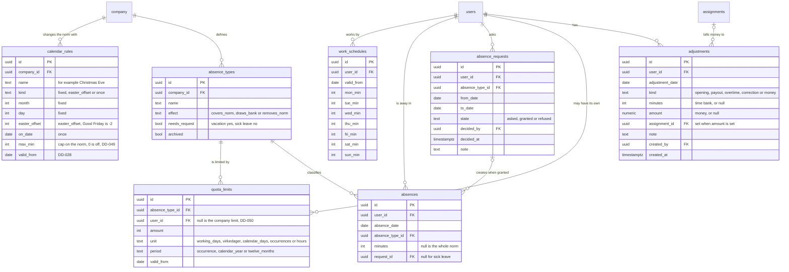

# Target data model

The Postgres model for the ASP.NET Core server, designed in B0 on 24 September 2026. It is the target, not the current schema. How the current SQLite data and the HTTP API reach it is decided separately.

The decisions are on the board: DD-028 to DD-041. The words are in `pm glossary`. This file holds only the shape.

## Work and money

## Time bank and absence

## Rules the diagram cannot show

- **Money is `numeric`, never a floating-point type.** An amount is rounded to whole øre once, at the approval.
- **No `ON DELETE CASCADE` anywhere.** Every foreign key to `users` uses `ON DELETE RESTRICT` (DD-037).
- **An entry's `user_id` must match its assignment.** A composite foreign key `(assignment_id, user_id)` to `assignments (id, user_id)` lets Postgres check it. The column exists for the index on `(user_id, entry_date)`.
- **A segment is named by its first date.** Segments never overlap, so `segment_start` is unique for each person. It replaces today's text key `2026-W09-2026-03`.
- **One active assignment for each person and project.** A partial unique index on `(user_id, project_id) WHERE ended_at IS NULL`.
- **Nothing derived is stored for a period that is not approved.** The norm, the balance and the amounts are computed. The approval freezes them (DD-029).
- **An adjustment holds minutes or money, never both.** A check constraint enforces it.

## Questions from part 1, answered in part 2

1. **Part days.** Decided in DD-049: a rule caps the norm (`max_min`), and the Norway preset gives a half day 240 minutes.
2. **Quota conditions for a person.** Decided in DD-050: a quota limit row may name one person and then replaces the company limit. No birth date is stored.
3. **Where the running timer lives.** Decided in DD-051: its own table, one row per person, and `entries.minutes` is not null.
4. **Language.** Decided 25 Sep: the company sets a default, and `users.language` overrides it for one person. Easy to change, so not a board decision.

## The bridge from the Node server

Decided in B0 part 2 on 24 and 25 Sep 2026.

| Decision | What it says                                                                                       |
| -------- | -------------------------------------------------------------------------------------------------- |
| DD-042   | One route for each action, not the whole-state `PUT /api/state`                                    |
| DD-043   | The C# types are the contract. The client's TypeScript types are generated from `/openapi/v1.json` |
| DD-044   | The .NET server starts on an empty Postgres database. No import from SQLite                        |
| DD-045   | One switch day in the same namespace. A failed switch is fixed forward                             |
| DD-046   | xUnit tests through `WebApplicationFactory`. The Node tests go with `server/`                      |
| DD-047   | Tests run on a Postgres that Testcontainers starts for each run                                    |
| DD-048   | EF Core with the Npgsql provider, and SQL by hand only where LINQ cannot express the query         |
| DD-052   | ASP.NET Core cookie authentication, without Identity. Data Protection keys in Postgres             |
| DD-053   | Every primary key is a UUID v7 that EF Core makes in .NET. Foreign keys are `uuid` too             |

## Deferred

A currency for each client. Billed time set by the admin (DD-035). Erasure of personal data (DD-037). Partitioning `entries` by date (DD-037). Export formats (DD-038).
